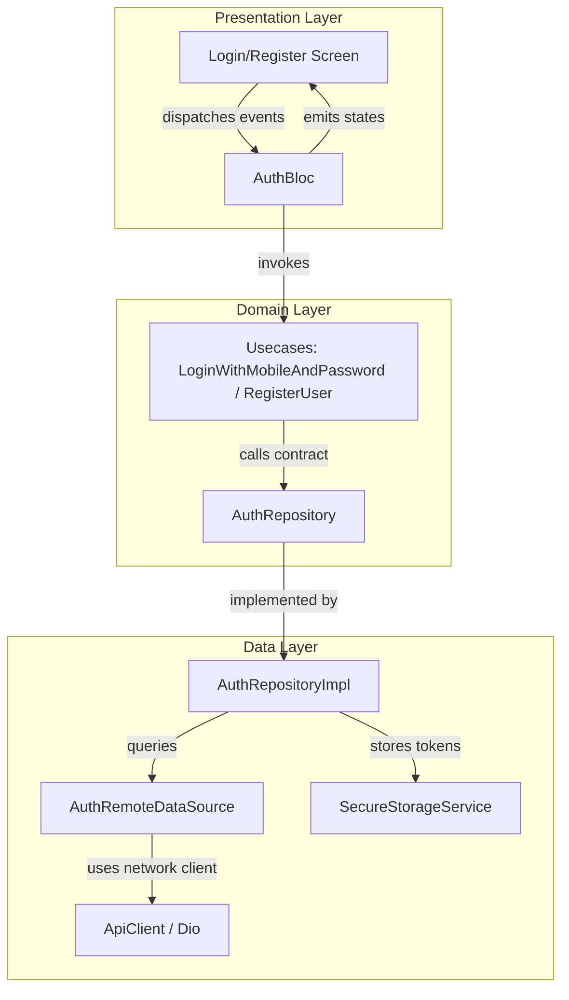

# Authentication Feature Design & Integration Document

This document outlines the architecture, data payloads, UI design system, and flows of the Authentication feature (Login and Registration) implemented in the Flutter application.

---

## 1. Feature Architecture Overview

The authentication feature follows the **Clean Architecture** paradigm, ensuring separation of concerns, testability, and high maintainability.



### Layer Responsibilities
- **Domain Layer**: Defines the core business entities (`User`, `RegistrationResult`, `RegisterUserRequest`), repository contracts (`AuthRepository`), and use cases representing business actions.
- **Data Layer**: Handles data retrieval from the remote backend REST endpoints via `AuthRemoteDataSource` and manages session persistence using `SecureStorageService`.
- **Presentation Layer**: Handles user interaction using the **BLoC pattern**. `AuthBloc` receives screen interaction events and produces UI states.

---

## 2. API Payloads & Specifications

All network requests automatically pass the `X-Tenant-Id: client-alpha` and `Content-Type: application/json` headers.

### A. User Registration Endpoint
- **URL**: `POST /v1/user/register`
- **Headers**:
  - `X-Tenant-Id: client-alpha`
  - `Accept-Language: <locale>` (e.g. `en`, `hi`)
  - `Content-Type: application/json`
- **Request Body**:
  ```json
  {
      "mobileNumber": "+1234567890",
      "password": "SecurePassword123!",
      "firstName": "John",
      "lastName": "Doe",
      "email": "john.doe@example.com",
      "username": "john_doe",
      "preferredLanguage": "en",
      "gender": "MALE"
  }
  ```
- **Response Body (Success)**:
  ```json
  {
      "traceId": "trace-12345",
      "status": "SUCCESS",
      "message": "Registration successful",
      "userProfileId": "profile-999",
      "username": "john_doe",
      "email": "john.doe@example.com"
  }
  ```

### B. User Login Endpoint
- **URL**: `POST /v1/user/login`
- **Headers**:
  - `X-Tenant-Id: client-alpha`
  - `Content-Type: application/json`
- **Request Body**:
  ```json
  {
      "mobileNumber": "+1234567890",
      "password": "SecurePassword123!"
  }
  ```
- **Response Body (Success)**:
  ```json
  {
      "id": 100,
      "name": "John Doe",
      "email": "john.doe@example.com",
      "token": "session_token_xyz",
      "refreshToken": "session_refresh_token_xyz"
  }
  ```

---

## 3. UI and UX Design Details

The screens are styled using a premium, clean design language defined in the shared theme:

- **Typography**: Outfit / Google Fonts integrated with responsive letter-spacing.
- **Themes**: Soft canvas backgrounds (`AppColors.scaffold` / `#FFF7F2`) with contrasting primary buttons.
- **Fields Visual Feedback**: Custom outline borders with validation highlights, input prefix icons (Phone, lock, account), and toggleable password visibility suffix icons.
- **State Feedback**: Integrated loading spinner directly within primary buttons during API calls to prevent duplicate submissions.

---

## 4. Registration Wizard Steps

The registration process is structured as a 3-step Wizard to ensure verified contact details before full profile registration:

```
[Step 1: Enter Mobile Number] 
          │
          ▼ (Click "Send OTP")
[Step 2: Enter Verification Code]
          │
          ▼ (Verify with "000000" code bypass)
[Step 3: Registration Profile Details Form]
          │
          ▼ (Click "Register" -> API request)
[Redirected to Home Screen]
```

1. **Step 1 (Mobile Input)**: User enters their mobile number. The layout displays a focused mobile input field and dispatches a verification trigger.
2. **Step 2 (OTP Verification)**: User inputs the verification code. Currently, entering `000000` functions as a local bypass code to progress.
3. **Step 3 (Profile Fields)**: The phone number becomes read-only and filled. The user fills in `username`, `email`, `password`, `firstName`, `lastName`, and selects their `gender` before completing registration via the endpoint payload.

---

## 5. Internationalization (i18n)

The application leverages standard Flutter Localization (`flutter_localizations`) via ARB resource files:
- `lib/l10n/app_en.arb` (English)
- `lib/l10n/app_hi.arb` (Hindi)

Language switcher dropdown in the header of the Auth page allows developers and users to toggle contexts dynamically. During registration, the selected language code is automatically passed under the `preferredLanguage` body field and the `Accept-Language` header.

